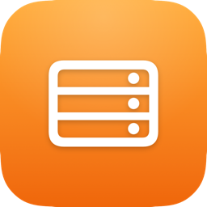
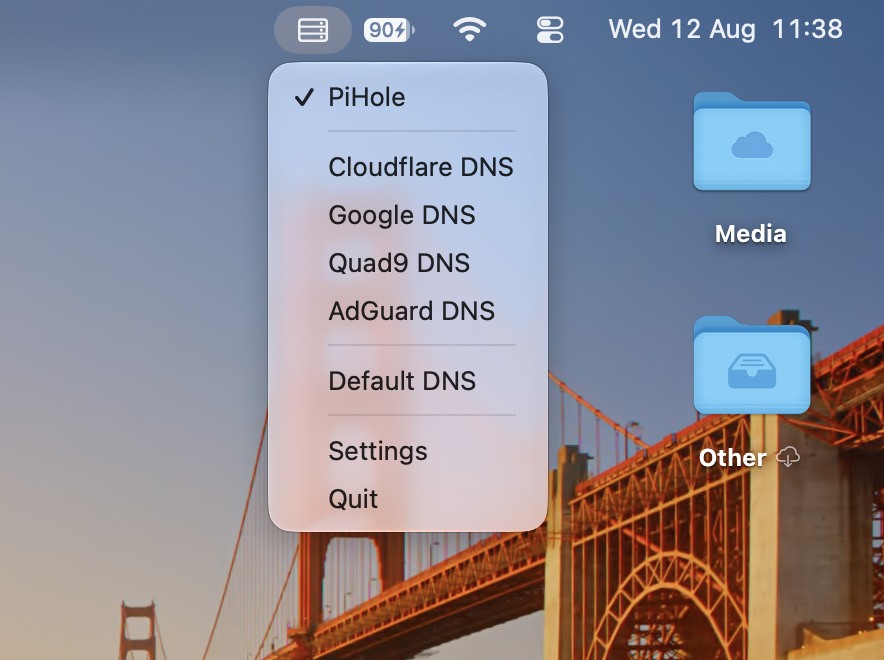
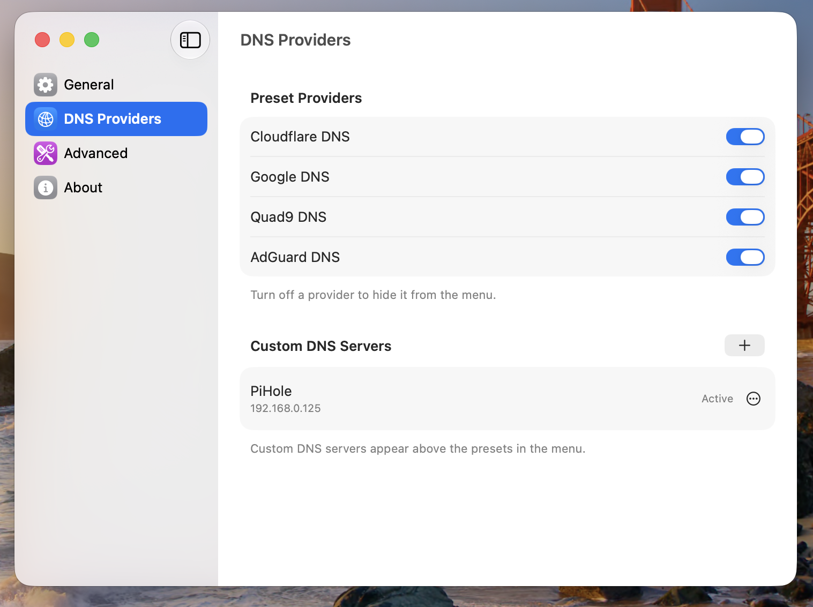
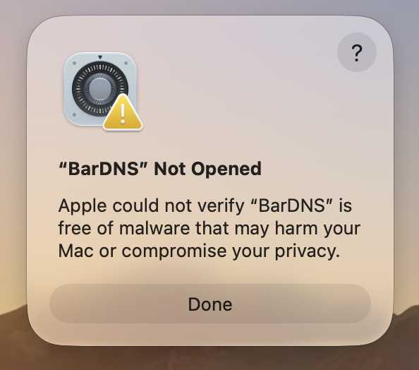
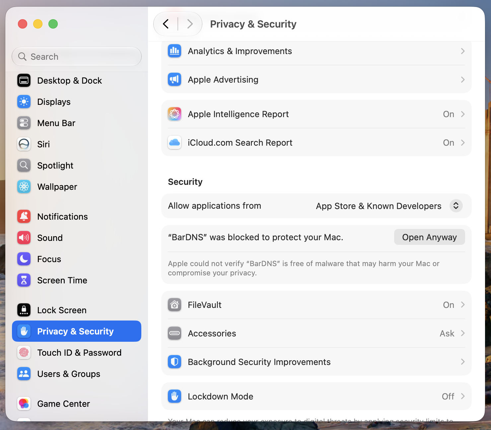
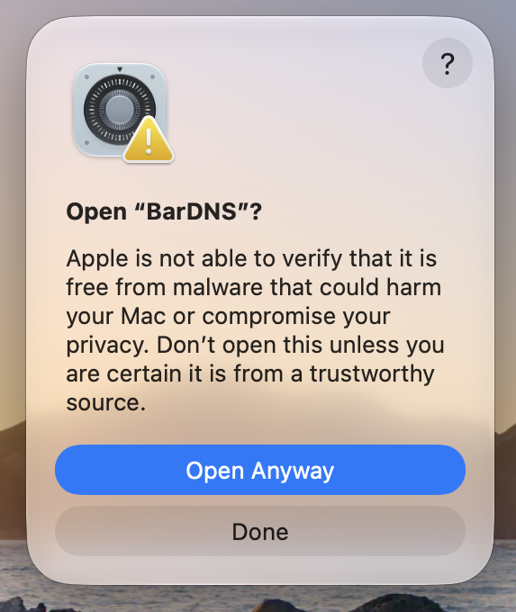

# BarDNS
   

A macOS menu bar app that allows you to quickly switch between different DNS providers (or add custom ones).

 

## Features

- Switch between popular DNS providers:
  - Cloudflare DNS (1.1.1.1)
  - Google DNS (8.8.8.8)
  - Quad9 DNS (9.9.9.9)
  - AdGuard DNS (94.140.14.14)
- Add, edit, and manage your own custom DNS servers
- Hide any preset provider you don't use, right from Settings
- Revert to Default DNS (whatever your router/ISP provides) with one click
- Test DNS speed to find the fastest provider
- Clear DNS Cache
- Launch at Login
- Switches DNS with no password prompt on administrator accounts
- Native macOS menu bar integration
- Persists your settings between app launches
- IPv4 and IPv6 support

## Installation

### Using Homebrew

```bash
brew tap Toadsta/tap
brew trust Toadsta/tap
brew install --cask bardns
```

The `brew trust` step is required the first time, since this is a third-party tap. To update to the latest version when available:

```bash
brew upgrade --cask bardns
```

### Manual Installation

1. Download the latest release from the [Releases](../../releases) page
2. Mount the DMG file
3. Drag BarDNS to your Applications folder
4. Launch BarDNS from Applications

### Uninstalling

- **Homebrew:** `brew uninstall --cask bardns`
- **Manual:** quit BarDNS, then drag `BarDNS.app` from Applications to the Trash

BarDNS reverts your DNS to default automatically when you switch it off, but if you uninstall while a DNS override is still active, remember to revert to Default DNS first.

## First Launch

Since BarDNS is ad-hoc signed only (not notarized by Apple), macOS will block it the first time you open it.

1. Open BarDNS from your Applications folder. You'll see a warning that Apple could not verify it — click "Done".

   

2. Go to System Settings > Privacy & Security, scroll down, and click "Open Anyway" next to the BarDNS warning.

   

3. Confirm by clicking "Open Anyway" again in the dialog that appears.

   

BarDNS should now launch normally on every future open.

## Requirements

- macOS 14.0 (Sonoma) or later
- An administrator account (recommended — standard accounts work, but prompt for a password on every DNS change)

## Tested Configurations

| macOS Version | Status |
|--------------|--------|
| Sonoma 14.5 | ✅ |
| Tahoe 26 | ✅ |
| Golden Gate 27.0 | ✅ |

## Building from Source

1. Clone the repository:
```bash
git clone https://github.com/Toadsta/BarDNS.git
```
2. Open the project in Xcode 15 or later
3. Build and run the project

## License

This project is licensed under the MIT License - see the [LICENSE](LICENSE) file for details.

## Contributing

Contributions are welcome! Please feel free to submit a Pull Request.

Found a bug or have a feature request? [Open an issue](../../issues).

## Acknowledgments

- [Gregory Linford](https://github.com/glinford) for creating the original [DNS Easy Switcher](https://github.com/glinford/dns-easy-switcher), which BarDNS is forked from
- [Cloudflare DNS](https://1.1.1.1) for their public DNS service
- [Quad9](https://quad9.net) for their secure DNS service
- [AdGuard DNS](https://adguard-dns.io/en/welcome.html) for their privacy-focused DNS service with ad blocking capabilities
- [Google Public DNS](https://developers.google.com/speed/public-dns) for their public DNS service

## Privacy

BarDNS does not collect any data. All settings are stored locally on your device.
